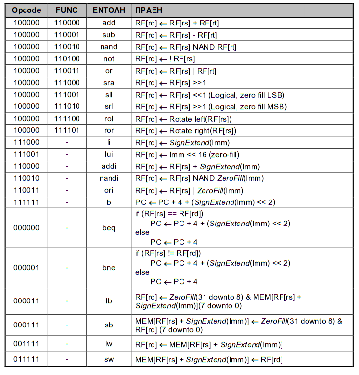
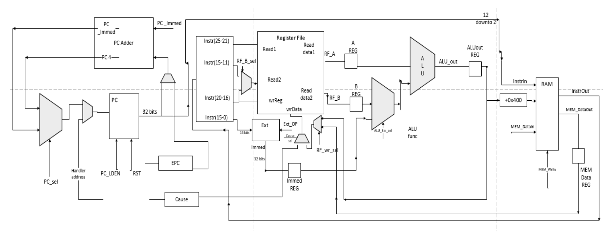
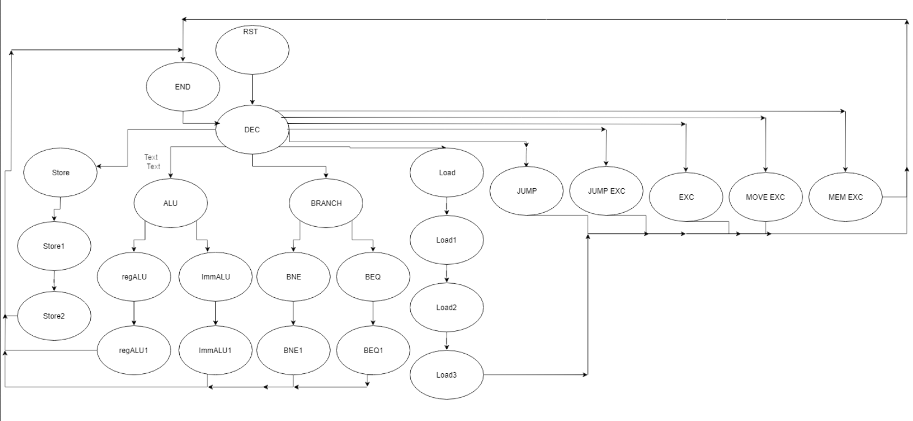
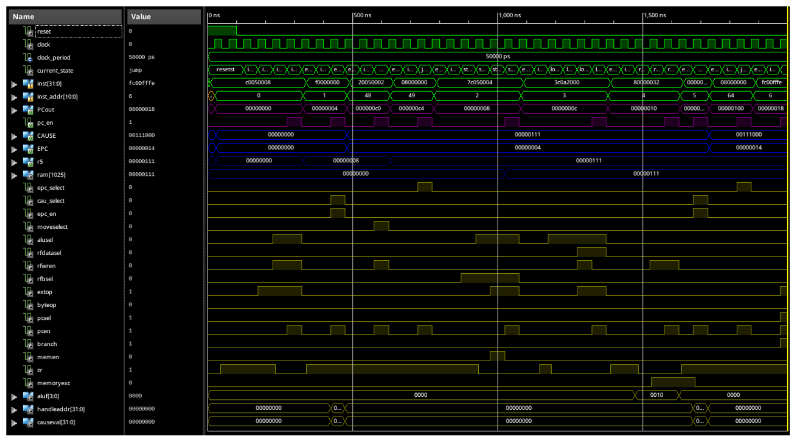

## Table of contents
* [General info](#general-info)
* [Technologies](#technologies)
* [Setup](#setup)
* [Design](#design)
* [Example](#example)

## General info
This project is a Xilinx ISE project, not aimed to be ported on a real FPGA, just for simulation purposes. Developed for the Computer Organisation class, spring semester 2018-2019, Technical University of Crete. 
	
## Technologies
Project is created with:
* Xilinx ISE (webpack): v.13.7
	
## Setup
To run this project, an excisting Xilinx installation is required.
Just clone the repo:

```
$ git clone https://github.com/ctsiaousis/mipsMultiCycleProcessor.git 
```

Then cd into the project folder and open the LAB4_impl.xise file with your ISE.

```
$ cd mipsMultiCycleProcessor/xilinxProject
```

## Design
* The CPU implements a subset of MIPS architecture instructions. More specifically:



* The Design is fairly simple and can also be viewed from the ISE. A simplified datapath is like so:

* Also the Datapath is auto controlled by a multiCycle FSM(state machine).


## Example
A simple example also included in the project's simulation files that covers the interrupt handling.

